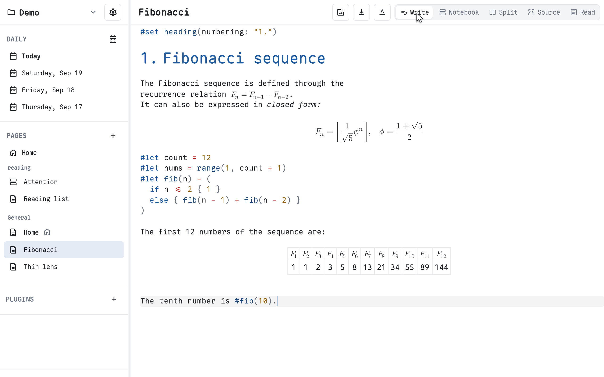

# Typbase

Local-first knowledge base built around the [Typst](https://typst.app) language.

[](docs/video/hero.mp4)

<!-- _A one-minute walkthrough: inline editing, workspace queries, math, themes, and export._ -->

## Features

- **Inline WYSIWYG.** Compiled output replaces the source as you type; click a rendered element to jump back to it. Split, Source, and Read views come with it.
- **Notebook cells.** `// %%` markers turn a page into cells that render in place and run with a click, with execution counters and Jupyter keybindings.
- **The workspace as data.** `#typbase.query`, `#typbase.embed`, `#typbase.page-link`, and `#typbase.section` read pages, categories, daily notes, and sections from inside a document.
- **Standalone output.** Export HTML, PDF, SVG, or a compilable Typst project. The source mirror is plain `.typ`, and `typst compile --root .` works outside the app.
- **Local-first.** Browser or desktop storage, content-addressed media, and optional sync and live collaboration through atproto Spaces. Publish a page as a public post when you want a URL.

<!-- - **Search and AI.** Local full-text search with optional semantic search, plus OpenAI-compatible, Anthropic, or Ollama providers for summaries, flashcards, and study guides. -->
<!-- - Web, desktop, and mobile builds. -->

## Technologies

- [Nuxt](https://nuxt.com) 5 (nightly), [Vue](https://vuejs.org) 3, and [CodeMirror](https://codemirror.net) 6 on the front end.
- [Typst](https://typst.app) 0.15 compiled to WebAssembly for the engine.
- [Loro](https://loro.dev) CRDTs for collaborative editing.
- [atproto](https://atproto.com) with [airspace](https://getair.space) for storage and sync.
- [sqlite-wasm-vec](https://github.com/yangbooom/sqlite-wasm-vec) and [transformers.js](https://github.com/huggingface/transformers.js) for search.
- [Tauri](https://tauri.app) 3 (alpha) for desktop and mobile.
- [pnpm](https://pnpm.io/) and [moonrepo](https://github.com/moonrepo/moonrepo) for monorepo management.

## Inspirations

- [Typst](https://typst.app) for the language and the idea that documents can be queried as data.
- [Notion](https://www.notion.com) and [Obsidian](https://obsidian.md) for the product shape: daily notes, categories, backlinks, and files on disk.
- [Mnemo](https://github.com/lemueldls/mnemo), the earlier Typst WYSIWYG editor whose editor and engine were extracted into Typbase.
- [The LEAST Private Operating System Ever Created](https://www.youtube.com/watch?v=M_720LesVg4) for reflective systems where everything is inspectable.
- [Dynamic Documents as Personal Software](https://www.youtube.com/watch?v=MccJdr61xnc) and [PlayBook: A Programmable Paper Notebook](https://www.youtube.com/watch?v=GurWDZ8ENpA) for documents that run their own code.

## Getting Started

### Prerequisites

- Node 26+
- pnpm 12+
- Rust with the `wasm32-unknown-unknown` target.

### Development

```sh
pnpm install
pnpm dev
```

## License

AGPL-3.0. See [LICENSE](LICENSE).
